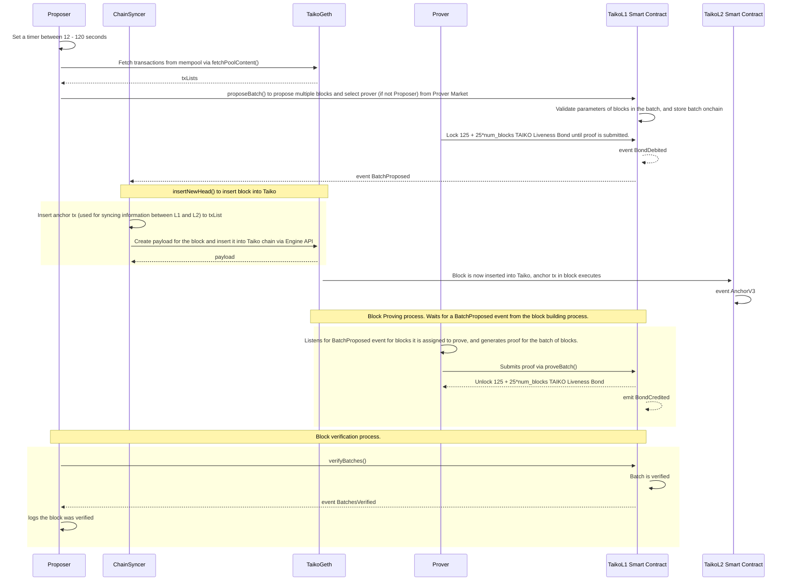

## Terminology

ChainSyncer, Proposer, and Prover are part of taiko-client, which is the consensus client. Taiko-Geth is the execution client, and TaikoL1 (deployed on Ethereum) & TaikoL2 (deployed on Taiko) are smart contracts.

A batch consists of multiple blocks.

## Block Building Steps

1. (For Taiko’s fallback proposer specifically) In `proposer` a timer is randomly set between 12 to 120 seconds for when to propose a block. 
    1. https://github.com/taikoxyz/taiko-mono/blob/6ab0ecd4d40f736158a63e66616f697972916a8f/packages/taiko-client/proposer/proposer.go#L150-L163
    2. https://github.com/taikoxyz/taiko-mono/blob/6ab0ecd4d40f736158a63e66616f697972916a8f/packages/taiko-client/proposer/proposer.go#L382
2. Once the timer is finished, `ProposeOp()` fetches transactions from L2 mempool and proposes them as a block to `TaikoL1`.
    1. `txLists` generated from `fetchPoolContent()` https://github.com/taikoxyz/taiko-mono/blob/6ab0ecd4d40f736158a63e66616f697972916a8f/packages/taiko-client/proposer/proposer.go#L281
        1. `fetchPoolContent()` does an API call to `taiko-geth` which returns list of transactions from mempool with a miner tip. https://github.com/taikoxyz/taiko-geth/blob/cdca79128bc606f89c12e08474f228ad5d0d89c3/eth/taiko_api_backend.go#L126
    2. `ProposeTxListPacaya()` sends `proposeBatch()` transaction to `TaikoL1` smart contract. https://github.com/taikoxyz/taiko-mono/blob/4a9202fffac67f14678a34daac6b0e6050fe7f64/packages/taiko-client/proposer/proposer.go#L401
        1. In this process, a check to ensure the proposer has enough TAIKO for the LivenessBond is conducted. https://github.com/taikoxyz/taiko-mono/blob/4a9202fffac67f14678a34daac6b0e6050fe7f64/packages/taiko-client/proposer/proposer.go#L424-L436
        2. `proposeBatch()` transaction is built in this part of the code. https://github.com/taikoxyz/taiko-mono/blob/4a9202fffac67f14678a34daac6b0e6050fe7f64/packages/taiko-client/proposer/transaction_builder/blob.go#L184-L194
3. `TaikoL1` ’s `proposeBatch()` is called onchain by any block proposer. 
    1. The parameters to be used for building a batch (blocks) is validated. https://github.com/taikoxyz/taiko-mono/blob/4a9202fffac67f14678a34daac6b0e6050fe7f64/packages/protocol/contracts/layer1/based/TaikoInbox.sol#L109-L115
        1. https://github.com/taikoxyz/taiko-mono/blob/4a9202fffac67f14678a34daac6b0e6050fe7f64/packages/protocol/contracts/layer1/based/TaikoInbox.sol#L743
    2. The metadata for the batch of blocks is created. https://github.com/taikoxyz/taiko-mono/blob/4a9202fffac67f14678a34daac6b0e6050fe7f64/packages/protocol/contracts/layer1/based/TaikoInbox.sol#L127-L148
    3. The batch is stored onchain. https://github.com/taikoxyz/taiko-mono/blob/4a9202fffac67f14678a34daac6b0e6050fe7f64/packages/protocol/contracts/layer1/based/TaikoInbox.sol#L166
    4. Proposer assigns a Prover to prove the batch, and Prover pays a 125 + 5 * num_blocks liveness bond.  https://github.com/taikoxyz/taiko-mono/blob/4a9202fffac67f14678a34daac6b0e6050fe7f64/packages/protocol/contracts/layer1/based/TaikoInbox.sol#L180-L182
        1. Note that the Proposer can also be the Prover if they do not use the Prover Market. https://github.com/taikoxyz/taiko-mono/blob/75db2c2082e966b51f09680b8c558a7068a3e001/packages/protocol/contracts/layer1/based/TaikoInbox.sol#L309
    5. `BatchProposed` event emitted
4. Block is proved by a Prover.
    1. Prover listens for `BatchProposed` events to determine if a proof needs to be requested for a block. https://github.com/taikoxyz/taiko-mono/blob/e10c62f9688cfe2db509435a0c7829591794307e/packages/taiko-client/prover/prover.go#L354-L360
        1. When a prover sees a new block via `blockProposedHandler.Handle()` from above, it submits a ProofRequestBody message. https://github.com/taikoxyz/taiko-mono/blob/e10c62f9688cfe2db509435a0c7829591794307e/packages/taiko-client/prover/event_handler/block_proposed.go#L346
    2. Upon seeing a proof request message, a proof is requested and generated via `requestProofOp()` https://github.com/taikoxyz/taiko-mono/blob/e10c62f9688cfe2db509435a0c7829591794307e/packages/taiko-client/prover/prover.go#L320-L321
    3. A proof is submitted via `submitProofOp()` https://github.com/taikoxyz/taiko-mono/blob/e10c62f9688cfe2db509435a0c7829591794307e/packages/taiko-client/prover/prover.go#L317-L318
        1. implementation: https://github.com/taikoxyz/taiko-mono/blob/e10c62f9688cfe2db509435a0c7829591794307e/packages/taiko-client/prover/proof_submitter/proof_submitter.go#L245
5. `chain_syncer` picks up `BatchProposed` event from L1 and inserts them into L2 chain.
    1. https://github.com/taikoxyz/taiko-mono/blob/4a9202fffac67f14678a34daac6b0e6050fe7f64/packages/taiko-client/driver/chain_syncer/blob/syncer.go#L109
    2. Iterates over all events seen on the L1. https://github.com/taikoxyz/taiko-mono/blob/6ab0ecd4d40f736158a63e66616f697972916a8f/packages/taiko-client/driver/chain_syncer/blob/syncer.go#L136-L143
    3. `insertNewHead()` is called to insert the block into the L2. https://github.com/taikoxyz/taiko-mono/blob/6ab0ecd4d40f736158a63e66616f697972916a8f/packages/taiko-client/driver/chain_syncer/blob/syncer.go#L265-L281
        1. `AnchorV3` tx is inserted to the very start of every block. https://github.com/taikoxyz/taiko-mono/blob/4a9202fffac67f14678a34daac6b0e6050fe7f64/packages/taiko-client/driver/chain_syncer/blob/blocks_inserter/pacaya.go#L176-L226
        2. `ExecutionPayload` is created via Engine API calls between the client (consensus) and taiko-geth (execution), and the block is now inserted into the L2. https://github.com/taikoxyz/taiko-mono/blob/4a9202fffac67f14678a34daac6b0e6050fe7f64/packages/taiko-client/driver/chain_syncer/blob/blocks_inserter/common.go#L124
6. Batch is verified.
    1. `verifyBatches()` is called at the end of step 3’s `proposeBatch()`. https://github.com/taikoxyz/taiko-mono/blob/4a9202fffac67f14678a34daac6b0e6050fe7f64/packages/protocol/contracts/layer1/based/TaikoInbox.sol#L586
    2. If the batch was proved within the proving time, the full 125 Taiko * num_of_blocks Liveness Bond is returned to the Prover. Otherwise, only half the amount is returned. https://github.com/taikoxyz/taiko-mono/blob/4a9202fffac67f14678a34daac6b0e6050fe7f64/packages/protocol/contracts/layer1/based/TaikoInbox.sol#L644-L646 
    3. `BatchesVerified()` event is emitted.