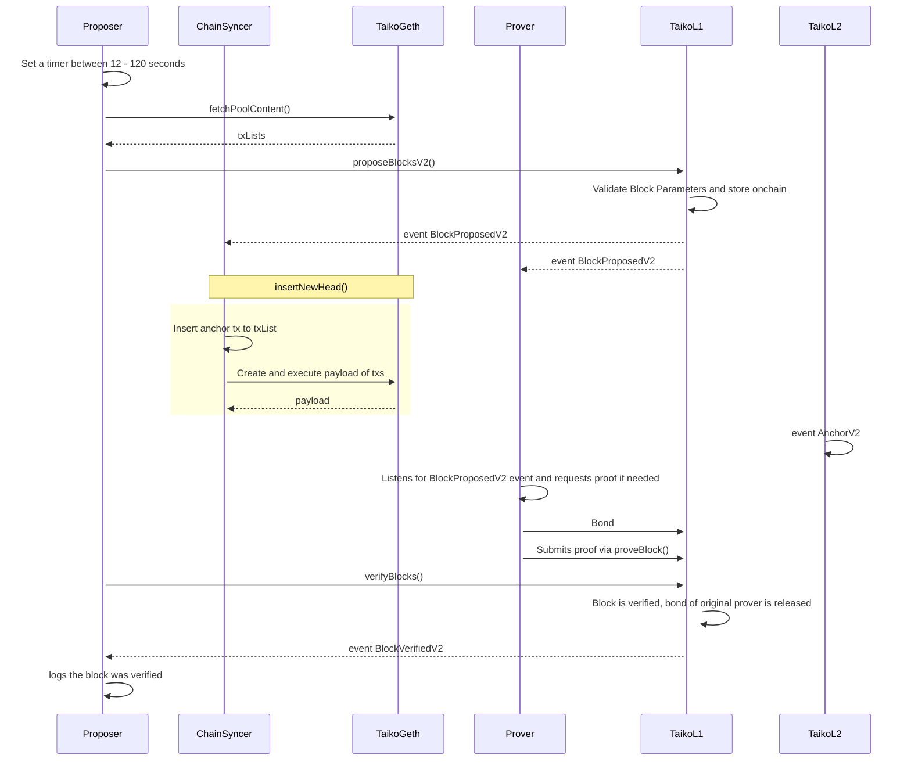

ChainSyncer, Proposer, and Prover are part of taiko-client, which is the consensus client. Taiko-Geth is the execution client, and TaikoL1 (deployed on Ethereum) & TaikoL2 (deployed on Taiko) are smart contracts.
